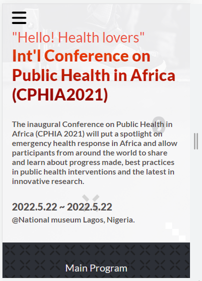
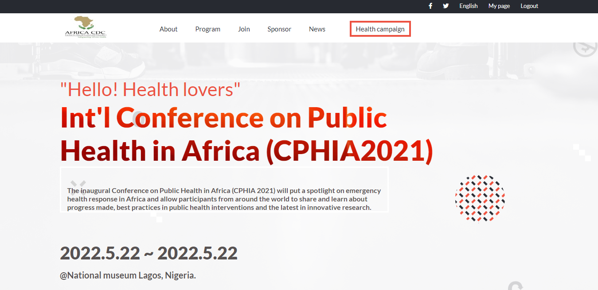

Mobile view

Desktop View

## <h1> Module one capstone Project</h1>
This is the final version of my project for the 5th week, Module 1. In this project I used all the knowledge I gathered from past weeks, and blended them nicely. 
Link to [video documentation](https://www.loom.com/share/8673649788154cf08cb1ce5393da630b).
It is a website for a fictitious, upcoming Health conference in Africa. Visit the Live Link to view the website.

## Setup
Simply fork this project and it should be ready for you to edit as you see fit.
In case you run into any errors please raise an [issue](https://github.com/ekenecf/Module-one-capstone/issues).

## Built With
- HTML
- Lighthouse (An open-source, automated tool for improving the quality of web pages. It has audits for performance, accessibility, progressive web apps, SEO and more).
- Webhint (A customizable linting tool that helps you improve your site's accessibility, speed, cross-browser compatibility, and more by checking your code for best practices and common errors).
- Stylelint (A mighty, modern linter that helps you avoid errors and enforce conventions in your styles).
- ESlint (A mighty, modern linter that helps you avoid errors and enforce conventions in JavaScript codes)
- Javascript

# Prerequisites
The basic requirements for building this project are:

VSCode or any other equivalent code editor
Node package manager

# Live Demo:
[Live Demo Link](https://ekenecf.github.io)

👤 **Author1**
- [@githubhandle](https://github.com/ekenecf)
- [@twitterhandle](https://twitter.com/ekene070)
- [LinkedIn](https://linkedin.com/in/EkeneNwachukwu)

## 🤝 Contributing
Contributions, issues, and feature requests are welcome!

## Show your support
Give a ⭐️ if you like this project!

## Acknowledgments
The design has been inspired by [Cindy Shin](https://www.behance.net/adagio07) design on Behance

## 📝 License